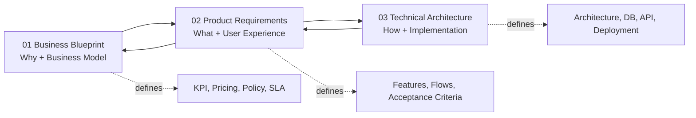
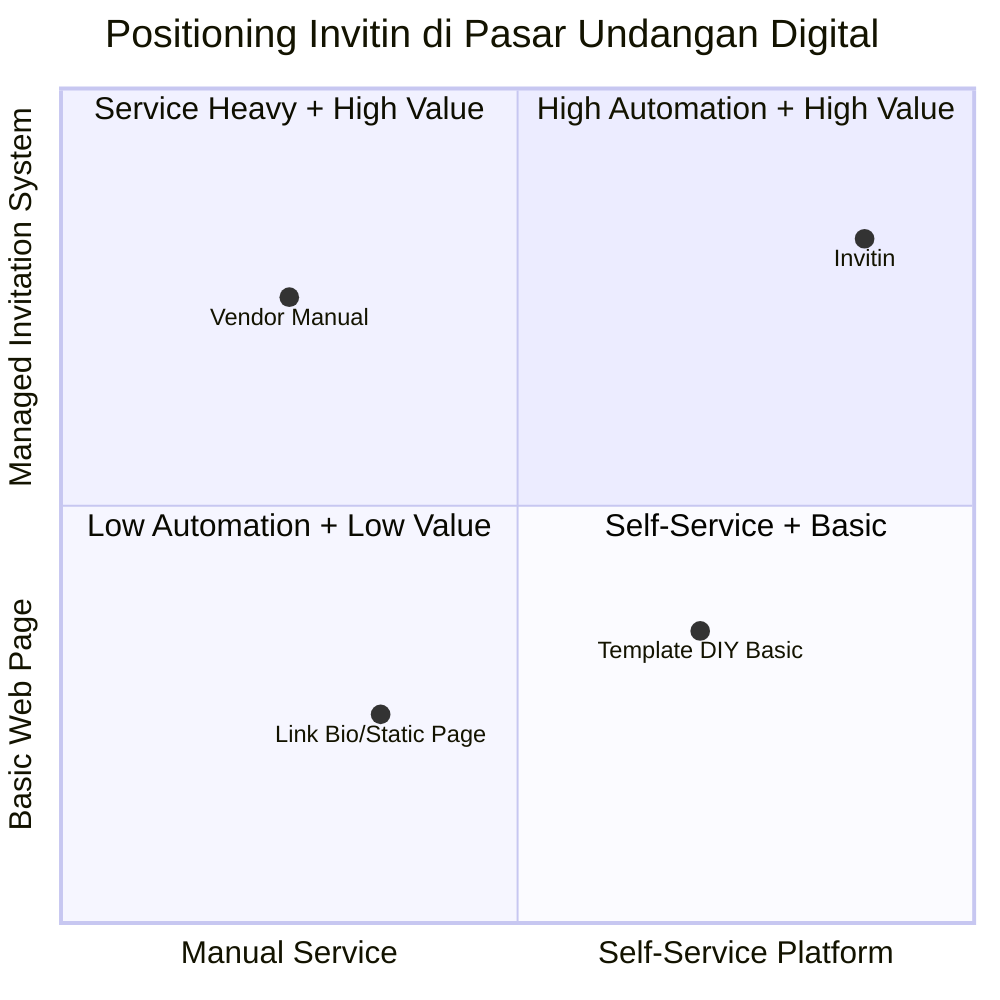
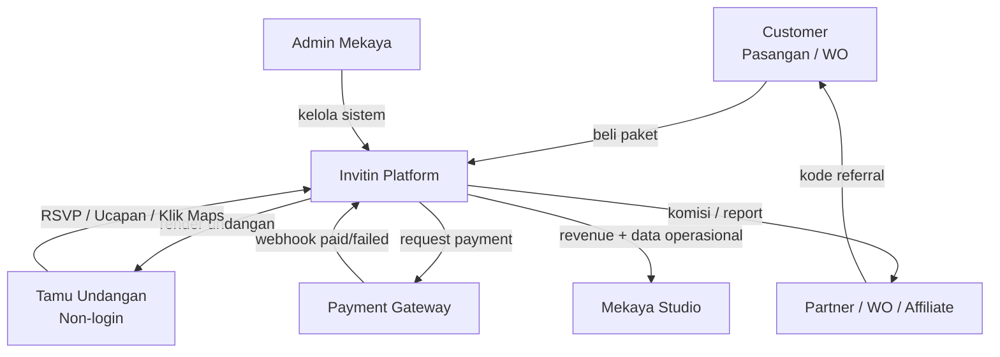
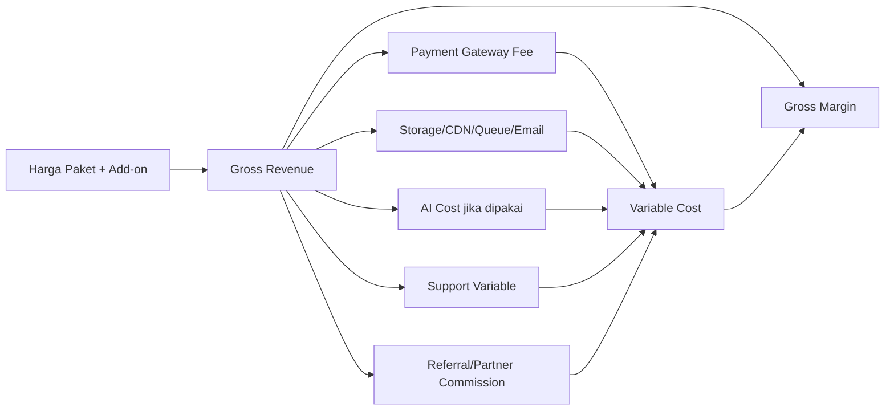
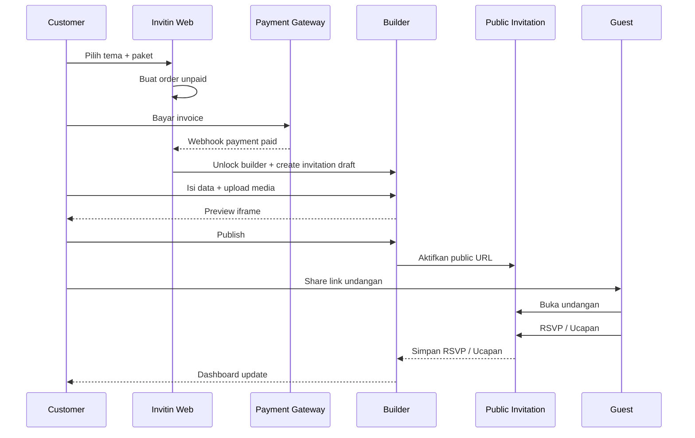
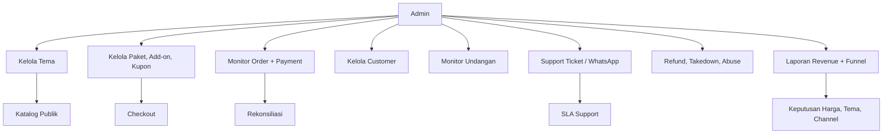
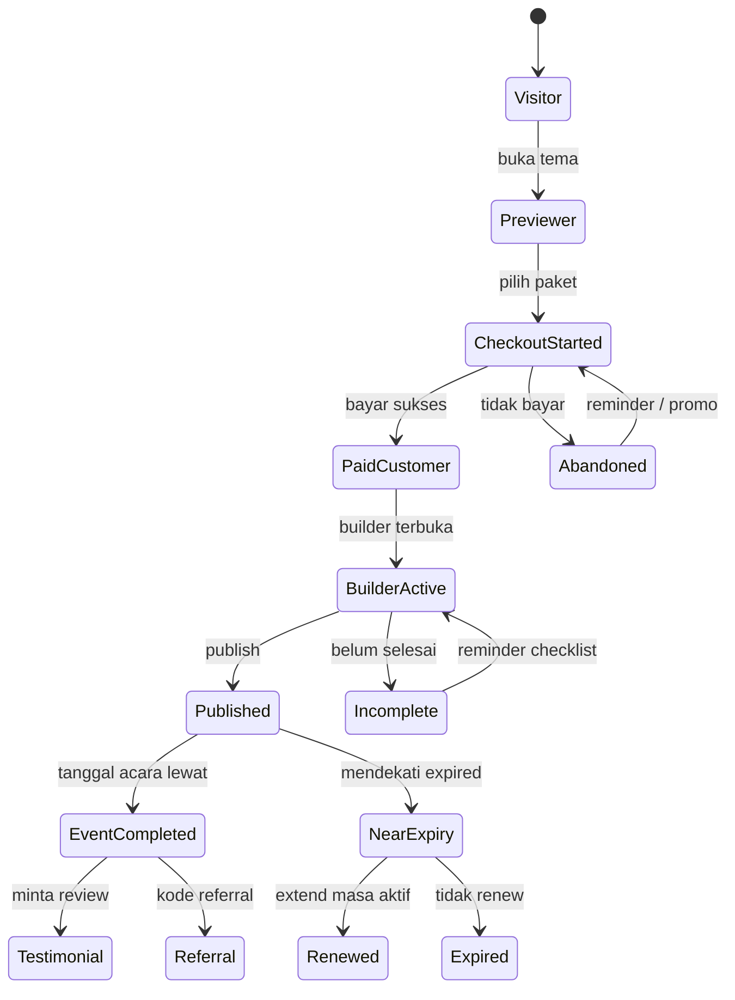
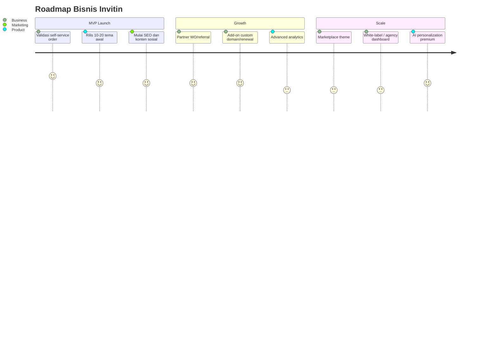

# INVITIN — Business Blueprint

**Produk:** Invitin by Mekaya Studio  
**Domain:** `invitin.mekayastudio.com`  
**Versi:** v1.3 — Dokumen Bisnis  
**Tanggal:** 30 Mei 2026  
**Fokus dokumen:** model bisnis, proses bisnis, monetisasi, operasional, legal-policy, go-to-market, dan KPI.

---

## 0. Hubungan dengan Dokumen Lain

Dokumen ini adalah sumber keputusan bisnis. Dokumen Produk menerjemahkan kebutuhan bisnis menjadi fitur dan acceptance criteria. Dokumen Teknis menerjemahkan fitur menjadi arsitektur Laravel, database, service, queue, deployment, dan pendekatan agentic.

| Dokumen | Fungsi | Output Utama |
|---|---|---|
| **01 — Business Blueprint** | Menjawab *mengapa bisnis ini dibuat dan bagaimana menghasilkan uang* | Target market, paket harga, revenue model, proses bisnis, policy, KPI |
| **02 — Product Requirements** | Menjawab *apa yang harus dibangun untuk memenuhi bisnis* | User journey, fitur, scope MVP, acceptance criteria, product states |
| **03 — Technical Architecture** | Menjawab *bagaimana produk dibangun secara teknis* | Laravel stack, module, schema, API, queue, deployment, agentic workflow |



**Dokumen terkait:**

- [02 — Product Requirements](./INVITIN_02_PRODUCT_REQUIREMENTS.md)
- [03 — Technical Architecture](./INVITIN_03_TECHNICAL_ARCHITECTURE_LARAVEL_AGENTIC.md)

---

## 1. Executive Summary Bisnis

Invitin adalah platform undangan digital self-service dari Mekaya Studio. Customer dapat memilih tema, membayar, mengisi data, preview, publish, membagikan link, dan memantau RSVP tanpa perlu chat admin untuk proses standar.

Model bisnis yang dituju bukan sekadar jasa pembuatan undangan digital manual, tetapi **produk digital berbasis template dan sistem self-service**. Tema dibuat sekali, dijual berkali-kali, lalu monetisasi diperluas lewat paket premium, add-on, custom domain, renewal, referral, dan partner wedding organizer.

### 1.1 Problem Statement

Vendor undangan digital manual biasanya memiliki bottleneck operasional:

- Customer harus chat admin untuk mulai order.
- Brief dan revisi tersebar di WhatsApp.
- Desainer/admin harus input data customer satu per satu.
- Proses publish bergantung jam kerja.
- RSVP dan data tamu tidak selalu terstruktur.
- Revenue sulit scale karena setiap order butuh campur tangan manusia.

### 1.2 Business Solution

Invitin mengubah alur menjadi:

> **Browse tema → checkout → bayar → isi data sendiri → preview → publish → share link → monitor RSVP.**

Dengan pendekatan ini, admin hanya perlu mengelola sistem, tema, harga, order, policy, dan support teknis, bukan menjadi operator input undangan harian.

---

## 2. Benchmark dan Diferensiasi

Benchmark publik yang dipakai adalah layanan undangan digital seperti Caraka Invitation: homepage, katalog tema, preview undangan, fitur RSVP, gallery, countdown, gift, custom domain, dan form pemesanan. Insight utamanya: pasar sudah familiar dengan undangan digital berbasis tema, tetapi masih banyak proses yang bersifat lead-based/manual.

Invitin harus mengambil pola bisnis yang terbukti dibutuhkan pasar, tetapi membuat diferensiasi sebagai platform self-service penuh.

| Area | Pola Benchmark | Arah Invitin |
|---|---|---|
| Pemilihan tema | Katalog dan preview tema | Katalog + preview + langsung checkout |
| Order | Form lead/manual | Checkout mandiri |
| Pengisian data | Umumnya dibantu tim | Customer isi sendiri via builder |
| Publish | Dikerjakan vendor | Customer publish sendiri |
| Revisi | Chat/manual | Edit mandiri di dashboard |
| RSVP | Ada di halaman undangan | Masuk dashboard dan bisa diekspor |
| Scale bisnis | Bergantung tim operasional | Template engine + automation |

---

## 3. Tujuan Bisnis dan KPI

### 3.1 Business Goals

| ID | Tujuan Bisnis | Penjelasan |
|---|---|---|
| **BIZ-G01** | Self-service revenue | Customer bisa membeli dan membuat undangan tanpa admin. |
| **BIZ-G02** | Template monetization | Tema menjadi aset digital yang dapat dijual berulang. |
| **BIZ-G03** | Operational leverage | Order standar tidak membutuhkan input manual dari admin. |
| **BIZ-G04** | RSVP data value | Invitin bukan hanya halaman undangan, tetapi alat kelola tamu. |
| **BIZ-G05** | Multi-channel growth | Akuisisi dari SEO, sosial media, paid ads, referral, dan partner. |
| **BIZ-G06** | Recurring/extension revenue | Ada revenue dari renewal, domain, add-on, dan upgrade. |

### 3.2 KPI Bisnis

| KPI | Definisi | Target Awal MVP |
|---|---|---:|
| Visitor to theme preview rate | Persentase pengunjung yang membuka preview tema | 20–35% |
| Preview to checkout rate | Persentase preview yang lanjut checkout | 5–12% |
| Checkout to paid rate | Persentase checkout yang berhasil bayar | 40–70% |
| Paid to published rate | Persentase customer paid yang berhasil publish | 80%+ |
| Time to first publish | Waktu dari pembayaran ke publish pertama | < 60 menit untuk self-service |
| Support per order | Jumlah tiket support per order | < 0,25 tiket/order |
| Refund rate | Order refund dibanding paid order | < 3% |
| Gross margin | Margin setelah gateway, storage, AI, support variable | 75–90% target awal |
| Powered-by conversion | Visitor dari link undangan publik yang masuk katalog | Diukur setelah launch |
| Referral order rate | Order dari kode referral/customer lama | 5–15% fase growth |

---

## 4. Target Market dan Persona

### 4.1 Segmentasi Pasar

| Segmen | Kebutuhan Utama | Sensitivitas Harga | Potensi Paket |
|---|---|---:|---|
| Pasangan budget | Undangan cepat, murah, tetap rapi | Tinggi | Basic |
| Pasangan sibuk | Tidak mau chat panjang, ingin beres sendiri | Sedang | Premium |
| Pasangan premium | Desain elegan, no watermark, custom domain | Rendah | Signature |
| Keluarga pengurus acara | Perlu dashboard sederhana dan link tamu | Sedang | Premium |
| Wedding organizer | Butuh banyak undangan untuk banyak klien | Sedang | Partner/Agency |
| Vendor wedding | Butuh add-on untuk klien mereka | Sedang | Partner/Referral |

### 4.2 Persona Prioritas MVP

#### Persona 1 — Pasangan Sibuk

- Usia 24–35.
- Terbiasa transaksi online.
- Banyak koordinasi pernikahan, ingin undangan cepat selesai.
- Butuh tampilan elegan, RSVP, gift, gallery, maps.
- Kemungkinan besar memilih **Premium**.

#### Persona 2 — Pasangan Budget

- Fokus biaya rendah.
- Tetap ingin undangan digital yang rapi.
- Rela ada limit gallery/watermark.
- Kemungkinan besar memilih **Basic**.

#### Persona 3 — Wedding Organizer Kecil

- Mengurus beberapa klien dalam satu bulan.
- Butuh proses cepat dan harga partner.
- Tidak perlu role baru di MVP; bisa dimulai dengan kode referral/kupon partner.

---

## 5. Positioning dan Value Proposition

### 5.1 Positioning Statement

> **Invitin adalah platform undangan digital self-service dari Mekaya Studio untuk pasangan dan wedding organizer yang ingin membuat undangan elegan, cepat, dan bisa dikelola sendiri dari satu dashboard.**

### 5.2 Value Proposition

| Value | Makna Bisnis |
|---|---|
| Cepat | Customer bisa publish di hari yang sama. |
| Mandiri | Tidak perlu menunggu admin untuk proses standar. |
| Elegan | Tema dikurasi oleh Mekaya Studio. |
| Terukur | RSVP, tamu, ucapan, dan analytics masuk dashboard. |
| Transparan | Harga, paket, add-on, dan masa aktif jelas. |
| Scalable | Tema reusable dan proses checkout otomatis. |

### 5.3 Differentiation



---

## 6. Aktor Bisnis

Sistem hanya memiliki dua role login: **Admin** dan **Customer**. Namun dari perspektif bisnis, ada aktor non-login yang perlu diperhitungkan.

| Aktor | Login? | Peran Bisnis |
|---|---|---|
| Admin | Ya | Mengelola platform, tema, paket, order, customer, policy, support. |
| Customer | Ya | Membeli dan membuat undangan. |
| Tamu | Tidak | Membuka undangan, RSVP, mengirim ucapan, klik maps/gift. |
| Payment gateway | Tidak | Memproses pembayaran dan webhook. |
| Partner/WO | Bisa sebagai customer | Membawa order melalui kode referral/kupon. |
| Mekaya Studio | Internal | Pemilik brand, desain tema, marketing, policy. |



---

## 7. Model Bisnis

### 7.1 Revenue Streams

| ID | Revenue Stream | Mekanisme |
|---|---|---|
| **REV-01** | Paket undangan digital | Basic, Premium, Signature. |
| **REV-02** | Tema premium | Tema tertentu hanya bisa dibeli sebagai premium/Signature. |
| **REV-03** | Add-on custom domain | Biaya setup dan/atau tahunan. |
| **REV-04** | Add-on remove watermark | Bisa standalone atau include paket atas. |
| **REV-05** | Add-on extra gallery | Tambahan kuota foto. |
| **REV-06** | Add-on masa aktif | Renewal sebelum/sesudah expired. |
| **REV-07** | Add-on export data | Export RSVP/guest list. |
| **REV-08** | Partner/WO volume order | Diskon volume atau komisi referral. |
| **REV-09** | AI copywriting premium | Opsional setelah MVP. |

### 7.2 Paket Harga Rekomendasi Awal

Angka di bawah adalah asumsi awal untuk validasi market. Harga final tetap harus bisa dikonfigurasi admin.

| Paket | Harga Rekomendasi | Masa Aktif | Gallery | Guest Link | RSVP | Ucapan | Gift | Music | Domain | Watermark |
|---|---:|---:|---:|---:|---|---|---|---|---|---|
| Basic | Rp149.000–Rp199.000 | 90 hari | 10 foto | 100 | Ya | Ya | Tidak | Library basic | Add-on | Ada |
| Premium | Rp299.000–Rp399.000 | 180 hari | 30 foto | 500 | Ya | Ya | Ya | Library + upload | Add-on | Tidak |
| Signature | Rp599.000–Rp799.000 | 365 hari | 75 foto | 1.500 | Ya | Ya | Ya | Premium | Include/add-on murah | Tidak |
| Partner Pack | Custom | Custom | Custom | Custom | Ya | Ya | Ya | Custom | Custom | Tidak |

### 7.3 Add-on Rekomendasi

| Add-on | Harga Awal | Catatan |
|---|---:|---|
| Custom domain setup | Rp150.000–Rp300.000 | Belum termasuk biaya domain jika dibeli pihak Invitin. |
| Extra gallery +25 foto | Rp50.000–Rp100.000 | Per paket kuota. |
| Extend 90 hari | Rp50.000–Rp100.000 | Renewal ringan. |
| Remove watermark | Rp50.000–Rp100.000 | Jika tidak include paket. |
| Export RSVP/guest CSV | Rp25.000–Rp50.000 | Bisa include Premium. |
| AI copywriting bundle | Rp25.000–Rp75.000 | Setelah AI runtime siap. |

### 7.4 Unit Economics Formula



Formula dasar:

```text
Gross Revenue = Package Price + Add-ons - Discount
Variable Cost = Payment Fee + Storage/CDN + AI Usage + Support Variable + Partner Commission
Gross Margin = Gross Revenue - Variable Cost
Gross Margin Rate = Gross Margin / Gross Revenue
```

Target awal: gross margin 75–90% untuk order self-service non-custom, di luar fixed cost tim, desain tema, dan development.

---

## 8. Proses Bisnis End-to-End

### 8.1 Value Stream Utama

```mermaid
flowchart LR
    A[Acquisition\nSEO, IG/TikTok, Ads, Referral] --> B[Theme Discovery\nLanding + Katalog]
    B --> C[Theme Preview]
    C --> D[Checkout]
    D --> E[Payment]
    E --> F[Builder Unlocked]
    F --> G[Data Entry + Upload]
    G --> H[Preview]
    H --> I[Publish]
    I --> J[Share to Guests]
    J --> K[RSVP + Wishes]
    K --> L[Dashboard Insight]
    L --> M[Renewal / Referral / Testimonial]
```



### 8.2 Proses Order Self-Service

| Step | Aktor | Aktivitas | Output |
|---:|---|---|---|
| 1 | Customer | Membuka landing/katalog | Customer paham value dan tema |
| 2 | Customer | Preview tema | Pilihan tema |
| 3 | Customer | Pilih paket/add-on | Cart/order draft |
| 4 | Customer | Register/login | Akun customer |
| 5 | Customer | Checkout | Invoice/payment instruction |
| 6 | Payment gateway | Konfirmasi pembayaran | Payment status paid/failed |
| 7 | System | Unlock builder | Invitation draft aktif |
| 8 | Customer | Isi data dan upload media | Draft lengkap |
| 9 | Customer | Preview | Validasi visual |
| 10 | Customer | Publish | Public URL aktif |
| 11 | Tamu | RSVP/ucapan | Data RSVP/wishes |
| 12 | Customer | Monitor dashboard | Insight acara |



### 8.3 Proses Admin Operasional



---

## 9. Policy Bisnis

### 9.1 Refund, Cancellation, dan Dispute

| Kasus | Policy Rekomendasi |
|---|---|
| Customer salah beli sebelum publish | Boleh ganti tema/paket; refund sebagian/full sesuai admin review. |
| Sudah publish | Refund umumnya tidak berlaku kecuali kesalahan sistem fatal. |
| Double payment | Refund penuh setelah verifikasi payment gateway. |
| Payment sukses tapi builder belum aktif | Admin wajib manual override setelah bukti valid. |
| Event batal | Berikan opsi pause/extend, bukan refund otomatis. |
| Custom domain sudah diproses | Tidak refundable. |
| Chargeback/dispute | Simpan invoice, webhook log, access log, dan bukti aktivasi. |

### 9.2 Data Privacy dan Retention

Invitin memproses data pribadi seperti nama customer, WhatsApp/email, nama tamu, RSVP, ucapan, foto, alamat acara, dan data rekening/e-wallet yang ditampilkan atas pilihan customer.

Requirement bisnis:

- Customer harus menyetujui Terms dan Privacy Policy saat checkout/register.
- Customer bertanggung jawab memiliki izin untuk menginput data tamu.
- Undangan publik default sebaiknya `noindex` untuk privasi.
- Customer dapat meminta penghapusan akun/undangan/data tamu.
- Data RSVP/guest disimpan selama masa aktif + grace period.
- Setelah expired dan melewati retention, data bisa diarsipkan atau dihapus sesuai policy.

### 9.3 Copyright dan Konten

Customer bertanggung jawab atas hak penggunaan:

- Foto prewedding/foto keluarga.
- Video.
- Musik/audio.
- Teks/quote.
- Logo dan aset lain.

Rekomendasi:

- Sediakan music library yang aman/royalty-free.
- Upload musik customer wajib disertai persetujuan hak penggunaan.
- Admin dapat melakukan takedown jika ada laporan pelanggaran.
- Terms harus melarang konten penipuan, SARA, pornografi, kekerasan, dan pelanggaran privasi.

### 9.4 SLA Support

| Kategori | Contoh Kasus | SLA Awal |
|---|---|---:|
| Critical public page | Link undangan tidak bisa dibuka | < 2 jam kerja |
| Payment | Sudah bayar tapi belum aktif | < 4 jam kerja |
| Upload/media | Foto gagal tampil | < 8 jam kerja |
| Builder issue | Form error, data tidak tersimpan | < 8 jam kerja |
| Domain | DNS/custom domain belum aktif | 1–2 hari kerja |
| Refund | Double payment/cancellation | 3–7 hari kerja |
| Abuse report | Penipuan/konten bermasalah | < 24 jam |

Prinsip support: **membantu kendala teknis, bukan menggantikan customer mengisi undangan standar.**

---

## 10. Customer Lifecycle dan Retention



### 10.1 Lifecycle Automation

| Momen | Trigger | Aksi Bisnis |
|---|---|---|
| Checkout abandoned 1 jam | Order unpaid | Reminder WhatsApp/email. |
| Checkout abandoned 24 jam | Order unpaid | Reminder + kupon terbatas. |
| Paid tapi belum publish 24 jam | Invitation draft | Checklist dan tutorial builder. |
| 14 hari sebelum acara | Published | Reminder cek RSVP, lokasi, jadwal. |
| 3 hari sebelum acara | Published | Final check reminder. |
| Setelah acara | Event date passed | Minta testimonial dan referral. |
| 30/14/7 hari sebelum expired | Active | Offer renewal. |
| Expired | Tidak renew | Archive page + CTA extend. |

---

## 11. Go-to-Market Strategy

### 11.1 Channel Strategy

| Channel | Strategi | KPI |
|---|---|---|
| SEO | Artikel intent tinggi: undangan digital, undangan online, contoh RSVP | Organic visitors, preview rate |
| Instagram/TikTok | Demo tema, before-after, tutorial builder, testimoni | Follower to preview, engagement |
| Paid Ads | Retarget pengunjung katalog dan checkout abandoned | CAC, ROAS, paid conversion |
| Referral Customer | Kupon untuk customer lama dan teman | Referral order rate |
| Wedding Organizer | Kode partner/volume pricing | Partner revenue |
| Powered-by Link | Link kecil di undangan Basic | Visitor from public page |
| Vendor Collaboration | Fotografer, MUA, dekorasi | Co-marketing leads |

### 11.2 Funnel Marketing

```mermaid
funnel-beta
    title Funnel Bisnis Invitin
    "Impression dari SEO/Ads/Sosial" : 10000
    "Landing Visitor" : 2500
    "Theme Preview" : 700
    "Checkout Started" : 120
    "Paid Order" : 70
    "Published Invitation" : 60
    "Referral/Testimonial" : 15
```

---

## 12. Partner dan Referral Model

### 12.1 Prinsip MVP

Tidak perlu role baru untuk partner pada MVP. Partner dapat dimulai sebagai customer atau entitas bisnis yang diberi:

- Kode kupon unik.
- Referral link dengan UTM.
- Komisi manual berdasarkan paid order non-refund.
- Dashboard partner dapat masuk fase MVP 2.

### 12.2 Model Komisi

| Model | Kelebihan | Kekurangan | Rekomendasi |
|---|---|---|---|
| Fixed commission/order | Mudah dihitung | Kurang fleksibel untuk paket mahal | Cocok awal |
| Percentage commission | Adil mengikuti nilai order | Butuh tracking lebih rapi | Cocok setelah sistem matang |
| Volume discount | Cocok WO yang beli banyak | Perlu kontrol abuse | Cocok B2B |
| White label | Margin tinggi | Kompleks secara teknis/support | Fase growth |

---

## 13. Risiko Bisnis dan Mitigasi

| Risiko | Dampak | Mitigasi |
|---|---|---|
| Customer bingung memakai builder | Paid tapi tidak publish | Wizard sederhana, template copy, tutorial, checklist. |
| Support overload | Margin turun | Self-service help center, SLA, automation. |
| Harga terlalu rendah | Margin dan brand turun | Paket bertingkat dan add-on. |
| Tema kurang menarik | Conversion rendah | Riset style, A/B katalog, rilis tema rutin. |
| Payment issue | Trust turun | Webhook idempotent, manual override, payment log. |
| Pelanggaran musik/foto | Legal risk | Policy hak cipta, takedown, library legal. |
| Data tamu bocor | Trust dan legal risk | Security, noindex, access control, retention. |
| Copycat kompetitor | Diferensiasi melemah | Brand, UX, partner, data dashboard, tema eksklusif. |
| Domain custom sulit dipahami | Support meningkat | Jadikan add-on premium dengan SOP jelas. |

---

## 14. Roadmap Bisnis



| Fase | Fokus Bisnis | Target Output |
|---|---|---|
| MVP | Validasi self-service order | 10–20 tema, checkout, builder, publish, RSVP. |
| Growth | Naikkan conversion dan revenue per order | Add-on, referral, SEO, partner, renewal. |
| Scale | B2B/agency dan automation | Partner dashboard, lebih banyak kategori event, AI premium. |

---

## 15. Traceability ke Produk dan Teknis

| Business ID | Kebutuhan Bisnis | Product Requirement Terkait | Technical Module Terkait |
|---|---|---|---|
| BIZ-G01 | Self-service revenue | PRD-ORD, PRD-BLD, PRD-PUB | Order, Payment, Builder, Public Renderer |
| BIZ-G02 | Template monetization | PRD-CAT, PRD-ADM-THEME | Theme Engine, Theme Versioning |
| BIZ-G03 | Operational leverage | PRD-ADM, PRD-NOTIF | Admin, Notifications, Queue |
| BIZ-G04 | RSVP data value | PRD-RSVP, PRD-GUEST | RSVP, Guest, Analytics |
| BIZ-G05 | Multi-channel growth | PRD-LANDING, PRD-SEO | Public Web, SEO, Analytics |
| BIZ-G06 | Renewal revenue | PRD-BILLING, PRD-LIFECYCLE | Billing, Scheduler, Notifications |
| REV-03 | Custom domain | PRD-DOMAIN | Domain Verification, Routing, SSL Ops |
| POLICY-PRIVACY | Data privacy | PRD-SETTINGS, PRD-EXPORT | Access Control, Retention Jobs, Audit Log |
| POLICY-CONTENT | Copyright/takedown | PRD-MEDIA, PRD-MODERATION | Media Validation, Moderation, Admin Actions |

---

## 16. Open Business Decisions

| ID | Keputusan yang Belum Final | Dampak |
|---|---|---|
| OBD-01 | Harga final paket dan add-on | Mempengaruhi checkout, limit fitur, dan positioning. |
| OBD-02 | Payment gateway utama | Mempengaruhi settlement, refund, dan metode pembayaran. |
| OBD-03 | Policy retention data setelah expired | Mempengaruhi storage, privacy policy, dan delete job. |
| OBD-04 | Apakah Basic memakai watermark | Mempengaruhi viral loop dan upsell. |
| OBD-05 | Komisi partner awal | Mempengaruhi margin dan channel growth. |
| OBD-06 | Apakah custom domain MVP atau fase 2 | Mempengaruhi kompleksitas teknis dan support. |

---

## 17. Definisi Sukses Bisnis MVP

MVP sukses secara bisnis jika dalam periode validasi awal:

1. Customer bisa membeli dan publish tanpa bantuan admin untuk mayoritas order.
2. Paid-to-published rate mencapai minimal 80%.
3. Support per order tetap rendah.
4. Paket Premium menjadi paket dengan kontribusi revenue terbesar.
5. Minimal satu channel acquisition menghasilkan order konsisten.
6. Tema yang dibuat dapat dijual berulang, bukan menjadi pekerjaan custom per customer.
7. Admin bisa menjalankan operasi harian dari dashboard tanpa akses database manual.

---

## 18. Referensi

- Caraka Invitation public benchmark: `https://caraka-invitation.com/`
- Caraka theme catalog benchmark: `https://caraka-invitation.com//tema-undangan.html`
- Caraka public invitation example benchmark: `https://caraka-invitation.com/freesia`
- UU No. 27 Tahun 2022 tentang Pelindungan Data Pribadi: `https://peraturan.bpk.go.id/Details/229798/uu-no-27-tahun-2022`
- Midtrans refund reference: `https://docs.midtrans.com/reference/refund-transaction`
