# INVITIN — Product Requirements Document

**Produk:** Invitin by Mekaya Studio  
**Domain:** `invitin.mekayastudio.com`  
**Versi:** v1.3 — Dokumen Produk  
**Tanggal:** 30 Mei 2026  
**Fokus dokumen:** user journey, scope MVP, fitur, page/module requirement, acceptance criteria, states, analytics, dan traceability ke bisnis serta teknis.

---

## 0. Hubungan dengan Dokumen Lain

Dokumen Produk adalah jembatan antara keputusan bisnis dan implementasi teknis.

- Input utama dari [01 — Business Blueprint](./INVITIN_01_BUSINESS_BLUEPRINT.md): target market, paket, pricing logic, policy, KPI, proses bisnis.
- Output utama ke [03 — Technical Architecture](./INVITIN_03_TECHNICAL_ARCHITECTURE_LARAVEL_AGENTIC.md): module requirement, data yang perlu disimpan, route/API, state, dan acceptance criteria.

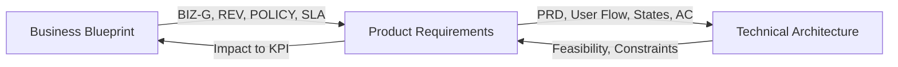

---

## 1. Product Vision

Invitin adalah platform self-service untuk membuat dan mengelola undangan digital. Customer dapat memilih tema, membeli paket, mengisi data, preview, publish, membagikan link, dan memonitor RSVP dari dashboard.

### 1.1 Product Principles

| Prinsip | Implikasi Produk |
|---|---|
| Self-service first | Customer bisa menyelesaikan order standar tanpa admin. |
| Mobile-first | Public invitation dan builder harus nyaman di ponsel. |
| One data, many themes | Data undangan disimpan sekali dan bisa dirender ke banyak tema. |
| Preview equals production | Preview memakai renderer yang sama dengan public invitation. |
| Admin minimal intervention | Admin mengelola sistem, bukan input data customer satu per satu. |
| Package-based limits | Fitur dibatasi paket dan bisa di-upgrade. |
| Privacy-aware | Undangan publik default tidak diindeks mesin pencari. |

### 1.2 Product Scope MVP

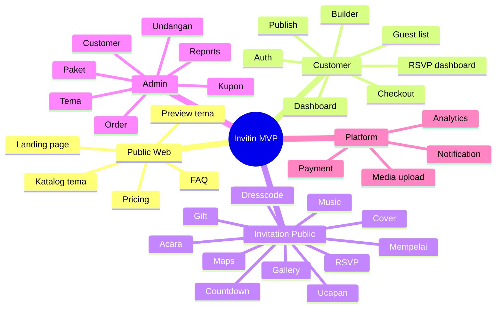

---

## 2. Role dan Permission Produk

Sesuai keputusan bisnis, hanya ada dua role login: **Admin** dan **Customer**. Tamu tidak perlu akun.

| Capability | Admin | Customer | Tamu Non-login |
|---|---:|---:|---:|
| Login dashboard admin | Ya | Tidak | Tidak |
| Login dashboard customer | Tidak | Ya | Tidak |
| Kelola tema | Ya | Tidak | Tidak |
| Kelola paket/harga/kupon | Ya | Tidak | Tidak |
| Checkout order | Tidak | Ya | Tidak |
| Buat/edit undangan sendiri | Tidak | Ya | Tidak |
| Publish/unpublish undangan sendiri | Tidak | Ya | Tidak |
| Force unpublish semua undangan | Ya | Tidak | Tidak |
| Buka undangan publik | Ya | Ya | Ya |
| RSVP | Tidak perlu | Tidak perlu | Ya |
| Kirim ucapan | Tidak perlu | Tidak perlu | Ya |
| Lihat RSVP undangan sendiri | Tidak | Ya | Tidak |
| Export RSVP | Admin semua | Customer sesuai paket | Tidak |

---

## 3. Information Architecture

### 3.1 Sitemap Publik, Customer, Admin

```mermaid
flowchart TB
    Home[/ /]
    Themes[/themes/]
    ThemeDetail[/themes/{theme}/]
    Pricing[/pricing/]
    FAQ[/faq/]
    Login[/login/]
    Register[/register/]

    App[/app/]
    AppInv[/app/invitations/]
    Builder[/app/invitations/{id}/builder/]
    Guests[/app/invitations/{id}/guests/]
    RSVP[/app/invitations/{id}/rsvp/]
    Orders[/app/orders/]
    Settings[/app/settings/]

    PublicInv[/u/{slug}/]

    Admin[/admin/]
    AdminThemes[/admin/themes/]
    AdminPackages[/admin/packages/]
    AdminOrders[/admin/orders/]
    AdminCustomers[/admin/customers/]
    AdminInv[/admin/invitations/]
    AdminReports[/admin/reports/]

    Home --> Themes --> ThemeDetail
    Home --> Pricing
    Home --> FAQ
    ThemeDetail --> Register
    ThemeDetail --> Login
    Register --> App
    Login --> App
    App --> AppInv --> Builder
    AppInv --> Guests
    AppInv --> RSVP
    App --> Orders
    App --> Settings
    Builder --> PublicInv
    Admin --> AdminThemes
    Admin --> AdminPackages
    Admin --> AdminOrders
    Admin --> AdminCustomers
    Admin --> AdminInv
    Admin --> AdminReports
```

### 3.2 Navigation Customer

| Menu | Fungsi |
|---|---|
| Overview | Ringkasan undangan, RSVP, status publish, quick action. |
| Undangan Saya | Daftar undangan customer. |
| Buat Undangan | Pilih tema/paket atau lanjut draft. |
| Builder | Wizard edit data undangan. |
| Guest List | Kelola nama tamu dan personalized link. |
| RSVP | Lihat/export data kehadiran. |
| Ucapan | Moderasi ucapan tamu. |
| Order & Invoice | Riwayat pembelian dan status pembayaran. |
| Account Settings | Profil, WhatsApp, email, password. |
| Help Center | Panduan self-service. |

---

## 4. End-to-End User Journey

### 4.1 Customer Journey

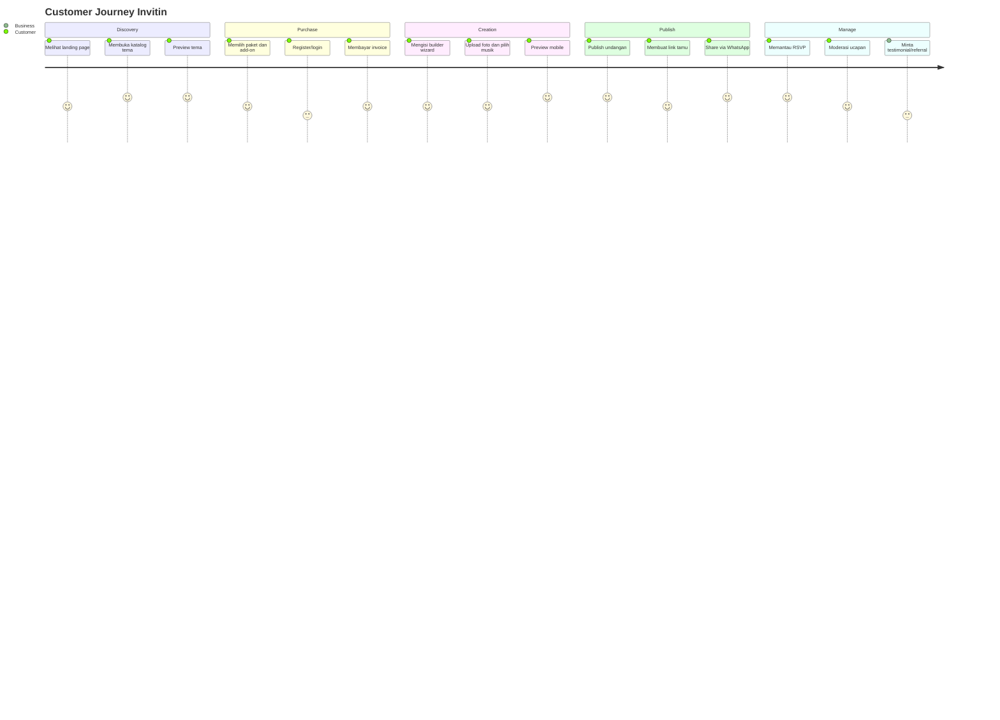

### 4.2 Guest Journey

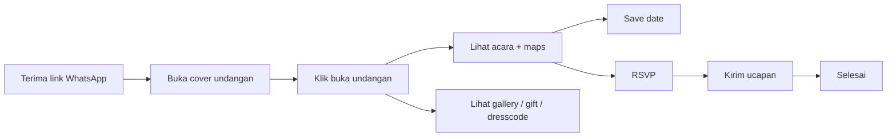

### 4.3 Admin Journey

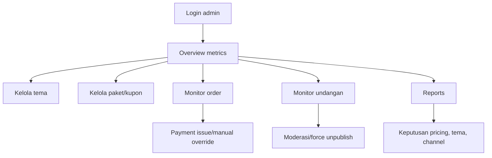

---

## 5. Product Epics

| Epic ID | Epic | Tujuan Bisnis Terkait | MVP |
|---|---|---|---:|
| **PRD-LANDING** | Public landing dan marketing page | BIZ-G05 | Ya |
| **PRD-CAT** | Katalog dan preview tema | BIZ-G02 | Ya |
| **PRD-AUTH** | Auth customer/admin | BIZ-G01 | Ya |
| **PRD-ORD** | Checkout, order, payment | BIZ-G01, REV-01 | Ya |
| **PRD-BLD** | Invitation builder | BIZ-G01 | Ya |
| **PRD-PUB** | Public invitation renderer | BIZ-G01, BIZ-G04 | Ya |
| **PRD-GUEST** | Guest list dan personalized link | BIZ-G04 | Ya |
| **PRD-RSVP** | RSVP, wishes, dashboard | BIZ-G04 | Ya |
| **PRD-ADM** | Admin dashboard | BIZ-G03 | Ya |
| **PRD-BILLING** | Add-on, renewal, invoice | REV-01–REV-08 | Sebagian |
| **PRD-DOMAIN** | Custom domain | REV-03 | Fase 2 |
| **PRD-AI** | AI copywriting/moderation/insight | REV-09 | Fase 2 |
| **PRD-PARTNER** | Referral/partner tracking | BIZ-G05 | Fase 2 |

---

## 6. Feature Requirements Detail

## 6.1 PRD-LANDING — Public Landing Page

### User Story

Sebagai visitor, saya ingin memahami value Invitin, melihat contoh tema, harga, cara kerja, dan FAQ agar yakin membuat undangan digital.

### Requirement

| ID | Requirement | Acceptance Criteria |
|---|---|---|
| LAND-01 | Hero section | Menampilkan headline, subheadline, CTA Lihat Tema dan Buat Undangan. |
| LAND-02 | Promo banner | Admin bisa mengubah teks promo dari dashboard. |
| LAND-03 | Featured themes | Menampilkan tema pilihan admin. |
| LAND-04 | Cara kerja | Menjelaskan pilih tema → bayar → isi data → publish → share. |
| LAND-05 | Pricing summary | Menampilkan paket dan fitur utama. |
| LAND-06 | FAQ | Admin bisa kelola FAQ. |
| LAND-07 | SEO metadata | Meta title, description, OG image tersedia. |

---

## 6.2 PRD-CAT — Katalog dan Preview Tema

### Requirement

| ID | Requirement | Acceptance Criteria |
|---|---|---|
| CAT-01 | List tema | Tema aktif muncul; tema inactive tidak muncul. |
| CAT-02 | Filter/sort | Filter kategori, style, latest, featured, price. |
| CAT-03 | Search | Customer bisa mencari nama tema/style. |
| CAT-04 | Preview | Preview bisa dibuka tanpa login. |
| CAT-05 | Use theme | Klik gunakan tema mengarah ke login/checkout. |
| CAT-06 | Badge | Tema bisa punya badge New, Best, Premium, Sale. |
| CAT-07 | Price display | Harga, diskon, dan paket terkait jelas. |

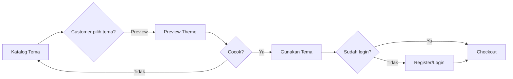

---

## 6.3 PRD-ORD — Checkout, Order, Payment

### Requirement

| ID | Requirement | Acceptance Criteria |
|---|---|---|
| ORD-01 | Cart/order draft | Order dibuat dengan status unpaid. |
| ORD-02 | Pilih paket | Customer memilih Basic/Premium/Signature. |
| ORD-03 | Add-on | Customer bisa memilih add-on sesuai paket. |
| ORD-04 | Kupon | Sistem validasi kupon aktif, kuota, minimum order. |
| ORD-05 | Invoice | Nomor invoice unik dan total jelas. |
| ORD-06 | Payment gateway | Status dibaca dari webhook gateway. |
| ORD-07 | Unlock builder | Builder aktif setelah status paid. |
| ORD-08 | Manual override | Admin bisa override dengan alasan dan audit log. |
| ORD-09 | Expired payment | Order berubah expired jika tidak dibayar sesuai batas waktu. |

### Order State

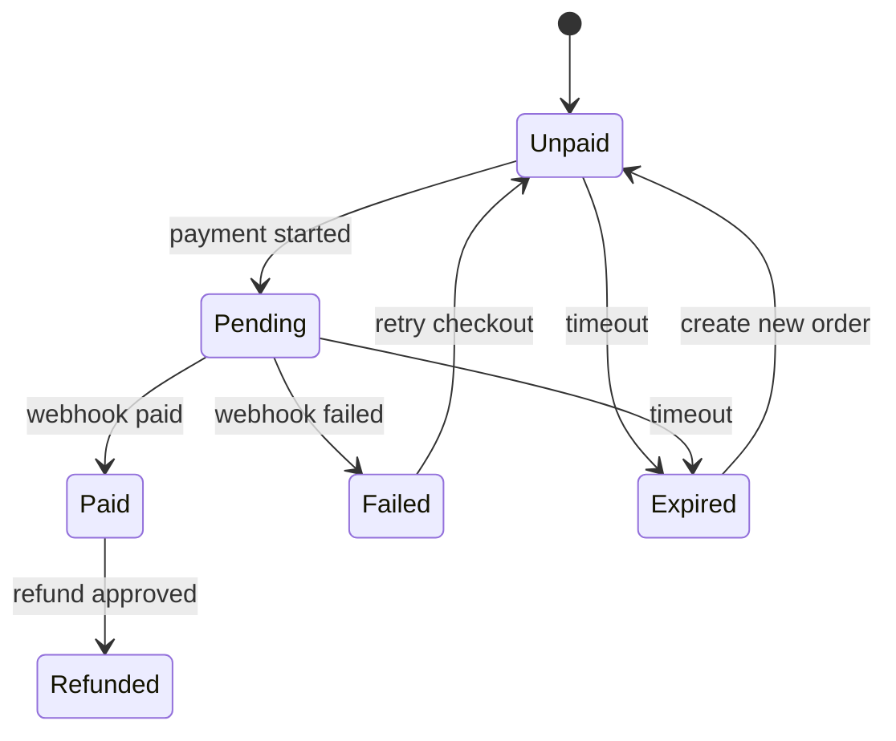

---

## 6.4 PRD-BLD — Invitation Builder

Builder harus berupa wizard agar customer non-teknis mudah mengikuti proses.

### 6.4.1 Builder Flow

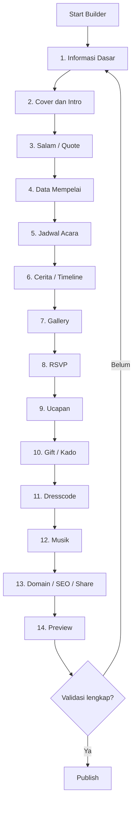

### 6.4.2 Builder Steps dan Field

| Step | Section | Field Utama | Wajib? |
|---:|---|---|---:|
| 1 | Informasi dasar | Judul, slug, nama pasangan, tanggal utama, bahasa | Ya |
| 2 | Cover/intro | Foto cover, teks cover, teks penerima, tombol buka | Ya |
| 3 | Quote/salam | Salam, quote/ayat/doa, sumber, deskripsi | Opsional |
| 4 | Mempelai | Nama lengkap, foto, orang tua, Instagram, deskripsi | Ya |
| 5 | Acara | Jenis acara, tanggal, jam, lokasi, alamat, maps | Ya |
| 6 | Story | Timeline cerita, tanggal, judul, deskripsi, foto | Opsional |
| 7 | Gallery | Upload foto, caption, urutan, cover gallery | Sesuai paket |
| 8 | RSVP | Aktif/nonaktif, batas orang, field RSVP, cutoff date | Sesuai paket |
| 9 | Ucapan | Aktif/nonaktif, moderasi, filter | Opsional |
| 10 | Gift | Bank/e-wallet/alamat hadiah | Sesuai paket |
| 11 | Dresscode | Warna, deskripsi, gambar inspirasi | Opsional |
| 12 | Musik | Library/upload, judul, artist, play/pause | Sesuai paket |
| 13 | SEO/share | Meta title, description, OG image, slug | Ya |
| 14 | Preview/publish | Preview mobile/desktop, checklist, publish | Ya |

### 6.4.3 Builder Acceptance Criteria

- Draft bisa disimpan kapan saja.
- Field wajib tervalidasi sebelum publish.
- Slug unik dan aman.
- Upload file divalidasi format dan ukuran.
- Limit fitur mengikuti paket.
- Preview memakai renderer yang sama dengan public invitation.
- Customer bisa edit setelah publish.
- Semua perubahan penting tercatat di activity log.

---

## 6.5 PRD-PUB — Public Invitation Page

### Sections

| Section | Tujuan | MVP |
|---|---|---:|
| Cover | First impression dan nama tamu | Ya |
| Countdown | Menampilkan hitung mundur acara | Ya |
| Salam/quote | Pembuka emosional/religius | Ya |
| Mempelai | Profil kedua mempelai | Ya |
| Jadwal acara | Akad/resepsi/pemberkatan/dll | Ya |
| Maps | Navigasi lokasi | Ya |
| Save date | Simpan ke kalender | Ya |
| Story | Cerita cinta/timeline | Ya |
| Gallery | Foto prewedding/dokumentasi | Ya |
| RSVP | Konfirmasi kehadiran | Ya |
| Ucapan | Doa dari tamu | Ya |
| Gift | Rekening/e-wallet/alamat hadiah | Ya |
| Dresscode | Panduan pakaian | Ya |
| Music | Audio background | Ya |
| Footer | Powered by Invitin / no watermark sesuai paket | Ya |

### Public Invitation Flow

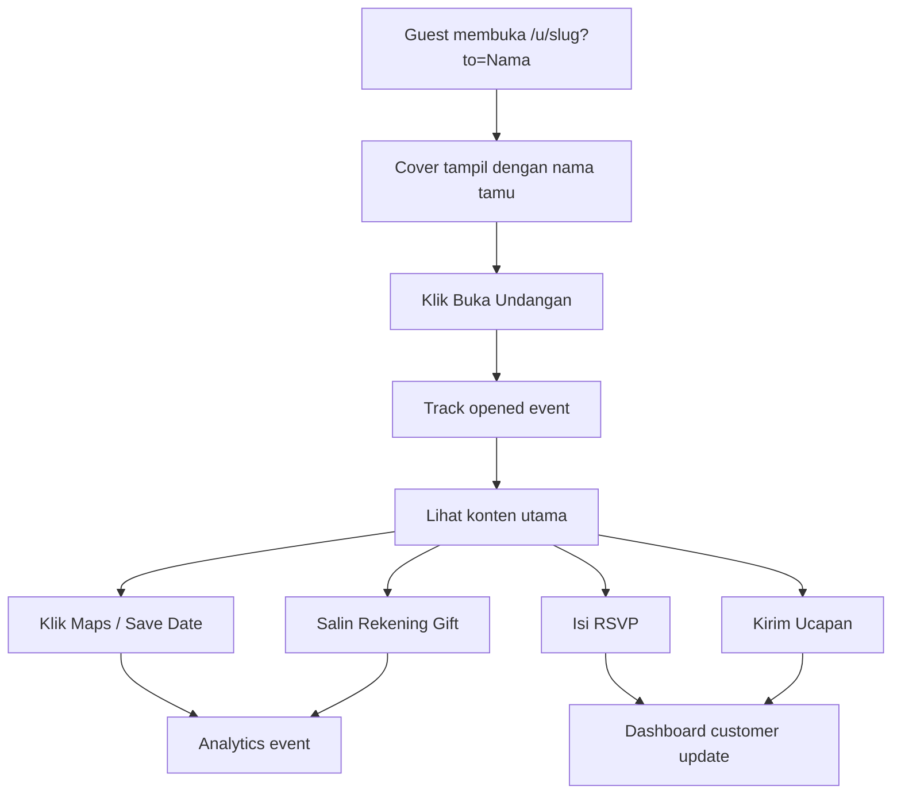

### Acceptance Criteria

- Public URL hanya aktif jika invitation status `published`.
- Jika `expired`, tampilkan halaman expired/renewal.
- Nama tamu tampil jika parameter `to` atau token tamu tersedia.
- Tamu tidak perlu login untuk RSVP/ucapan.
- RSVP dan ucapan memiliki anti-spam/rate limit.
- Halaman mobile-first dan ringan.
- Default `noindex` kecuali customer/admin mengaktifkan indexing.

---

## 6.6 PRD-GUEST — Guest List dan Personalized Link

### Requirement

| ID | Requirement | Acceptance Criteria |
|---|---|---|
| GUEST-01 | Tambah tamu manual | Customer bisa input nama, phone, group. |
| GUEST-02 | Import CSV | Customer bisa import banyak tamu sesuai paket. |
| GUEST-03 | Personalized link | Sistem membuat link unik per tamu. |
| GUEST-04 | Copy/share link | Customer bisa copy link atau share WhatsApp. |
| GUEST-05 | Track viewed/opened | Sistem mencatat view/open jika memungkinkan. |
| GUEST-06 | RSVP strict mode | Satu guest link bisa dibatasi satu RSVP. |
| GUEST-07 | Export | Export guest dan RSVP sesuai paket. |

URL default:

```text
https://invitin.mekayastudio.com/u/{slug}?to={nama_tamu}
```

URL tokenized:

```text
https://invitin.mekayastudio.com/i/{guest_token}
```

---

## 6.7 PRD-RSVP — RSVP, Wishes, Moderation

### RSVP Requirement

| ID | Requirement | Acceptance Criteria |
|---|---|---|
| RSVP-01 | Submit RSVP | Tamu input nama, status, jumlah orang, pesan opsional. |
| RSVP-02 | Cutoff date | RSVP ditutup otomatis setelah tanggal batas. |
| RSVP-03 | Dashboard | Customer melihat total hadir/tidak hadir/pending. |
| RSVP-04 | Export CSV | Sesuai paket. |
| RSVP-05 | Duplicate handling | Deteksi duplicate berdasarkan guest token/phone/nama. |
| RSVP-06 | Rate limit | Anti-spam IP/user-agent. |

### Wishes Requirement

| ID | Requirement | Acceptance Criteria |
|---|---|---|
| WISH-01 | Kirim ucapan | Tamu input nama dan pesan. |
| WISH-02 | Moderasi | Customer bisa hide/delete. |
| WISH-03 | Approval mode | Customer bisa mengaktifkan pending approval. |
| WISH-04 | Filter | Basic profanity/spam filter. |

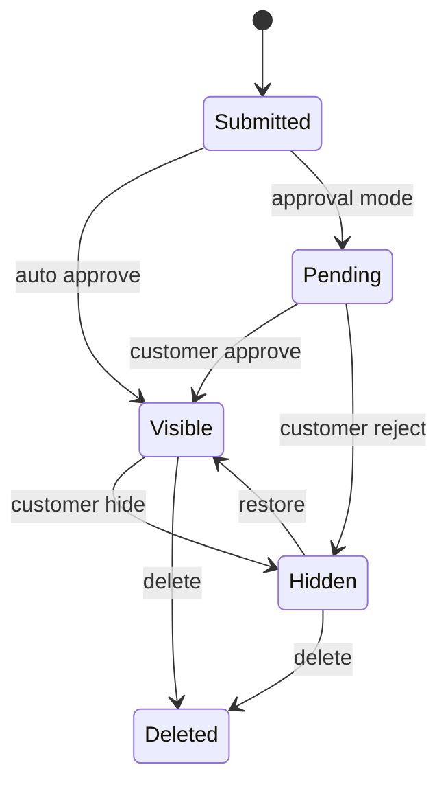

---

## 6.8 PRD-ADM — Admin Dashboard

### Admin Modules

| Module | Requirement |
|---|---|
| Dashboard | Revenue, order, paid/pending/failed, published invitations, top themes. |
| Themes | CRUD tema, harga, badge, kategori, preview, active/inactive. |
| Theme versions | Renderer key, schema, supported sections, changelog. |
| Packages | CRUD paket, limit gallery, guest, RSVP, gift, domain, watermark. |
| Coupons | Kode, jenis diskon, kuota, periode, minimum order, paket berlaku. |
| Orders | List, filter, detail invoice, payment log, manual override. |
| Customers | List, detail, status, reset password, suspend. |
| Invitations | List semua undangan, force unpublish, extend, inspect content. |
| Content | Hero, FAQ, testimonials, social links, payment logos. |
| Reports | Revenue, funnel, top themes, conversion, export. |
| Support tools | Lihat audit log, resend notification, cek payment. |

### Admin Permission Principle

- Semua aksi berisiko harus memiliki audit log.
- Manual payment override wajib alasan.
- Force unpublish wajib alasan.
- Admin tidak boleh melihat password atau credential sensitif.
- Akses admin dipisahkan via route `/admin` dan middleware role.

---

## 6.9 PRD-AI — AI Features Fase 2

AI bukan syarat MVP, tetapi stack teknis disiapkan agar bisa menambahkan fitur berikut.

| AI Feature | User | Value | Guardrail |
|---|---|---|---|
| Copywriting undangan | Customer | Membuat teks pembuka, quote, story | Output bisa diedit customer. |
| Rekomendasi tema | Customer | Menyarankan tema sesuai style/warna | Tidak memaksa pilihan. |
| Ucapan moderation assist | Customer/Admin | Deteksi spam/kata kasar | Human override. |
| RSVP insight | Customer | Ringkasan jumlah hadir, grup, risiko overcapacity | Hanya berdasarkan data customer. |
| Support assistant | Admin | Membantu cek order dan issue | Read-only default, audit log. |

---

## 7. Product State Model

### 7.1 Invitation State

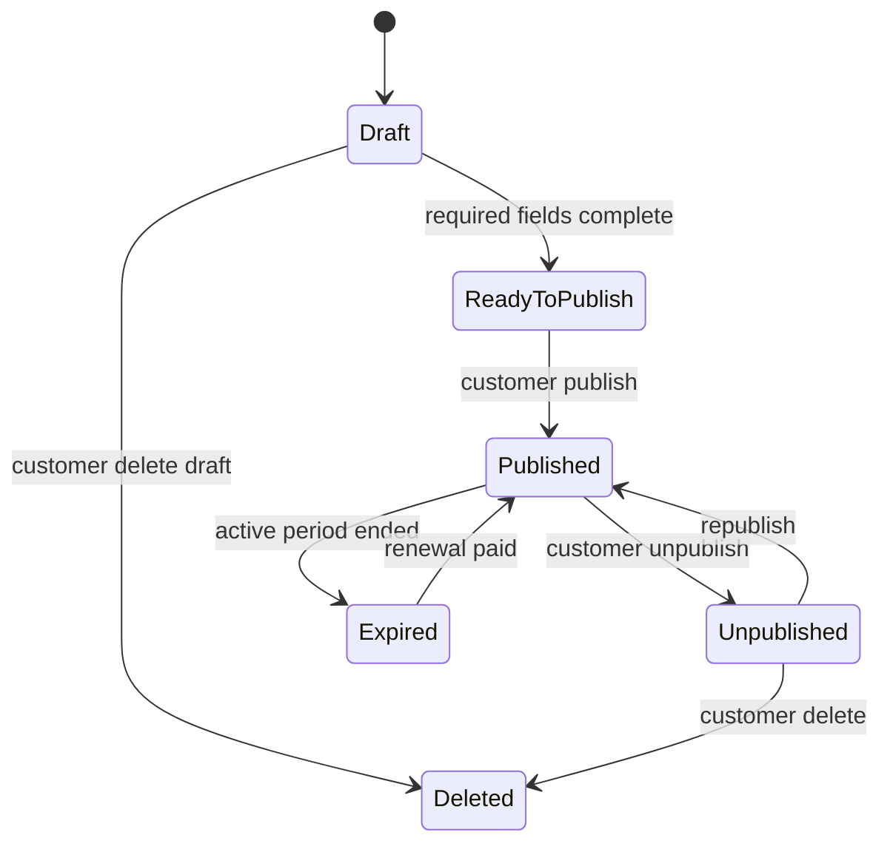

### 7.2 Payment-to-Invitation Dependency

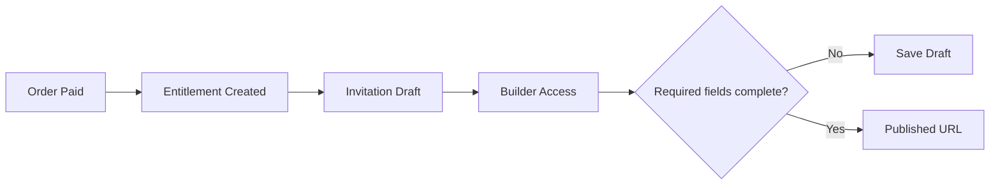

---

## 8. Notifications Requirement

| Trigger | Channel | Recipient | Template |
|---|---|---|---|
| Register | Email/WhatsApp | Customer | Welcome + verify. |
| Order created | Email/WhatsApp | Customer | Invoice/payment instruction. |
| Payment paid | Email/WhatsApp | Customer | Builder unlocked. |
| Payment expired | Email/WhatsApp | Customer | Retry payment. |
| Draft inactive 24 jam | Email/WhatsApp | Customer | Continue builder. |
| Publish success | Email/WhatsApp | Customer | Public URL and share guide. |
| RSVP submitted | In-app/email optional | Customer | RSVP notification summary. |
| Near event date | Email/WhatsApp | Customer | Final checklist. |
| Near expiry | Email/WhatsApp | Customer | Renewal offer. |
| Support/admin event | In-app/email | Admin | Issue/action alert. |

---

## 9. Analytics Events

| Event | Source | Purpose |
|---|---|---|
| `landing_viewed` | Public web | Funnel top. |
| `theme_list_viewed` | Katalog | Discovery. |
| `theme_previewed` | Preview | Interest. |
| `checkout_started` | Checkout | Conversion. |
| `payment_paid` | Payment webhook | Revenue. |
| `builder_started` | Builder | Activation. |
| `builder_step_completed` | Builder | Drop-off analysis. |
| `invitation_published` | Builder | Core success. |
| `public_invitation_viewed` | Public page | Reach. |
| `invitation_opened` | Public page | Guest engagement. |
| `maps_clicked` | Public page | Utility. |
| `save_date_clicked` | Public page | Utility. |
| `rsvp_submitted` | Public page | RSVP conversion. |
| `wish_submitted` | Public page | Engagement. |
| `gift_copied` | Public page | Gift interaction. |
| `renewal_clicked` | Lifecycle | Revenue expansion. |

---

## 10. MVP, Fase 2, Fase 3

### MVP 1 — Launchable Core

- Landing page.
- Katalog dan preview tema.
- Auth admin/customer.
- Checkout dan payment.
- Customer dashboard.
- Builder wizard.
- Public invitation renderer.
- Guest list dan personalized link.
- RSVP dan wishes.
- Gift, gallery, music, dresscode.
- Admin CRUD tema, paket, kupon, order, customer, undangan.
- Basic reports.

### Fase 2 — Revenue dan Automation

- Custom domain.
- Renewal automation.
- Partner/referral tracking.
- Export advanced.
- AI copywriting.
- AI moderation assist.
- Advanced analytics.
- Music library management.

### Fase 3 — Scale

- Partner dashboard.
- White-label agency.
- Marketplace theme.
- Multi-event categories: ulang tahun, aqiqah, corporate event.
- QR check-in.
- Seating arrangement.

---

## 11. Acceptance Checklist MVP

| Area | Acceptance Criteria |
|---|---|
| Public web | Visitor bisa memahami produk, melihat tema, pricing, FAQ. |
| Katalog | Tema aktif tampil dan bisa dipreview tanpa login. |
| Auth | Customer dan admin punya akses terpisah. |
| Checkout | Customer bisa bayar dan status paid membuka builder. |
| Builder | Customer bisa isi data, upload media, simpan draft, preview. |
| Publish | Undangan hanya bisa publish jika field wajib lengkap. |
| Public invitation | Link aktif, mobile-first, RSVP/wishes/gift/maps bekerja. |
| Guest list | Customer bisa membuat personalized link. |
| Dashboard customer | RSVP dan wishes terlihat. |
| Admin | Admin bisa kelola tema, paket, order, customer, undangan. |
| Security | Customer tidak bisa akses data customer lain. |
| Policy | Refund, takedown, retention, dan copyright punya mekanisme minimal. |

---

## 12. Traceability Matrix

| Business Need | Product Epic | Technical Module |
|---|---|---|
| Self-service order | PRD-CAT, PRD-ORD, PRD-BLD | Catalog, Order, Payment, Builder |
| Template monetization | PRD-CAT, PRD-ADM | Theme Engine, Theme Versioning |
| Operational leverage | PRD-ADM, PRD-NOTIF | Admin, Queue, Notification |
| RSVP data value | PRD-GUEST, PRD-RSVP | Guest, RSVP, Analytics |
| Pricing/add-on | PRD-ORD, PRD-BILLING | Package, Entitlement, Billing |
| Privacy/legal | PRD-PUB, PRD-GUEST, PRD-SETTINGS | Access Control, Retention, Audit |
| Go-to-market | PRD-LANDING, PRD-SEO | Public Web, SEO, Analytics |
| Agentic AI future | PRD-AI | Laravel AI SDK, MCP, AI Jobs |

---

## 13. Open Product Decisions

| ID | Decision | Owner | Impact |
|---|---|---|---|
| OPD-01 | Apakah customer bisa ganti tema setelah publish? | Product/Tech | Theme engine dan preview. |
| OPD-02 | Apakah Basic boleh upload musik sendiri? | Business/Product | Cost dan copyright risk. |
| OPD-03 | RSVP strict mode default aktif atau opsional? | Product | UX tamu dan data quality. |
| OPD-04 | Custom domain masuk MVP atau fase 2? | Business/Tech | Complexity support dan DNS. |
| OPD-05 | Default guest link pakai query `to` atau token? | Product/Tech | Privacy dan analytics. |
| OPD-06 | Apakah public invitation bisa diindeks Google? | Business/Legal | Privacy dan SEO. |

---

## 14. Definition of Done Produk MVP

Produk siap MVP jika:

1. Customer bisa menyelesaikan flow utama dari katalog sampai publish.
2. Admin bisa mengelola kebutuhan operasional harian tanpa database manual.
3. Public invitation dapat dibuka cepat di mobile.
4. Data RSVP dan ucapan masuk dashboard customer.
5. Payment webhook aman, idempotent, dan bisa diaudit.
6. Paket dan limit fitur berjalan konsisten.
7. Policy minimal untuk refund, copyright, privacy, dan takedown dapat dijalankan admin.
8. Analytics funnel utama tercatat untuk evaluasi bisnis.
