# INVITIN — Technical Architecture Laravel Agentic

**Produk:** Invitin by Mekaya Studio  
**Domain:** `invitin.mekayastudio.com`  
**Versi:** v1.3 — Dokumen Teknis  
**Tanggal:** 30 Mei 2026  
**Fokus dokumen:** arsitektur Laravel, module boundary, data model, route/API, queue, security, deployment, observability, dan pendekatan agentic.

---

## 0. Hubungan dengan Dokumen Lain

Dokumen Teknis menerjemahkan requirement produk menjadi implementasi Laravel.

- Input dari [02 — Product Requirements](./INVITIN_02_PRODUCT_REQUIREMENTS.md): product epics, user flow, states, acceptance criteria.
- Input bisnis dari [01 — Business Blueprint](./INVITIN_01_BUSINESS_BLUEPRINT.md): pricing, policy, SLA, KPI, privacy, refund, partner, lifecycle.
- Output dokumen ini: arsitektur, schema, service, route, queue, deployment, testing, dan agentic workflow.

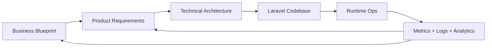

---

## 1. Keputusan Stack Final

| Area | Keputusan |
|---|---|
| Application architecture | Laravel 13 modular monolith |
| Starter kit | Laravel React Starter Kit |
| Dashboard customer | Inertia React + TypeScript + Tailwind + shadcn/ui |
| Dashboard admin | Inertia React + TypeScript + Tailwind + shadcn/ui |
| Public invitation page | Blade + Vite + Tailwind, cacheable |
| Preview builder | iframe ke Blade renderer yang sama dengan public page |
| Database | PostgreSQL |
| Cache/queue/session | Redis |
| File storage | S3-compatible storage / Cloudflare R2 |
| CDN/DNS/WAF | Cloudflare |
| Payment | Adapter untuk Midtrans/Xendit/Tripay |
| Notification | Mail + WhatsApp provider adapter |
| Background jobs | Laravel Queue + Horizon |
| Observability | Logs, Telescope/Pulse optional, error monitoring |
| Dev agentic | Laravel Boost |
| Runtime AI product feature | Laravel AI SDK |
| Internal AI ops/MCP | Laravel MCP optional fase 2 |

Laravel React Starter Kit cocok karena menyediakan fondasi Laravel + React dengan Inertia, TypeScript, Tailwind, dan shadcn/ui untuk dashboard interaktif. Public invitation tetap Blade agar ringan, mudah dicache, dan tidak membebani tamu dengan aplikasi React penuh.

---

## 2. Arsitektur Tingkat Tinggi

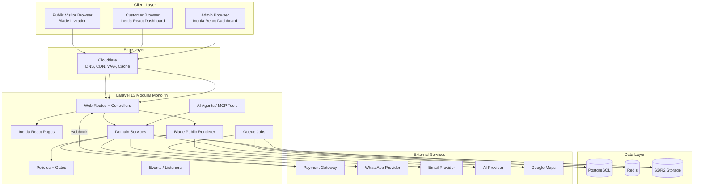

---

## 3. Modular Monolith Boundary

Struktur domain dibuat modular agar tetap sederhana untuk MVP tetapi mudah dipecah jika scale.

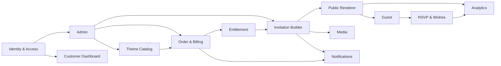

### 3.1 Module List

| Module | Responsibility | Product Epic |
|---|---|---|
| Identity | Auth, roles, permissions, profile | PRD-AUTH |
| Catalog | Themes, categories, style, preview metadata | PRD-CAT |
| Pricing | Packages, add-ons, coupons, entitlements | PRD-ORD, PRD-BILLING |
| Order | Invoice, payment status, gateway callbacks | PRD-ORD |
| Builder | Invitation CRUD, wizard data, validation | PRD-BLD |
| Renderer | Blade rendering public invitation and preview | PRD-PUB |
| Guest | Guest list, personalized links, view tracking | PRD-GUEST |
| RSVP | RSVP, wishes, moderation, export | PRD-RSVP |
| Media | Upload, image compression, thumbnails, audio | PRD-BLD |
| Notification | Email/WhatsApp/event lifecycle | PRD-NOTIF |
| Admin | Admin dashboard and operations | PRD-ADM |
| Analytics | Product/business/event analytics | PRD-ANALYTICS |
| AI | Runtime AI features via Laravel AI SDK | PRD-AI |
| AgentOps | Dev/internal agent tools via Boost/MCP | Technical/Ops |

---

## 4. Frontend Architecture

### 4.1 Rendering Decision

```mermaid
flowchart TB
    subgraph Dashboard[Dashboard Experience]
        InertiaReact[Inertia + React + TypeScript]
        Forms[Builder Forms]
        Tables[Admin Tables]
        Charts[Reports]
    end

    subgraph Public[Public Invitation Experience]
        BladeRenderer[Blade Renderer]
        ThemeViews[Theme Blade Partials]
        PublicJS[Small Vanilla/Alpine JS]
        CSS[Tailwind/Vite CSS]
    end

    BuilderPreview[Builder Preview iframe] --> BladeRenderer
    PublicURL[/u/{slug}] --> BladeRenderer
    InertiaReact --> BuilderPreview
```

### 4.2 Why This Split

| Area | Inertia React | Blade Public Renderer |
|---|---|---|
| Dashboard/customer/admin | Cocok: form kompleks, tables, state UI | Tidak ideal untuk UI interaktif besar |
| Public invitation | Terlalu berat jika React penuh | Cocok: cepat, server rendered, cacheable |
| Preview | React hanya shell builder | iframe ke Blade agar sama dengan public |
| SEO/OG | Bisa, tetapi lebih kompleks | Lebih mudah dari Laravel response |
| Performance guest | Bundle besar | Bundle kecil dan lazy media |

---

## 5. Data Architecture

### 5.1 Core ERD

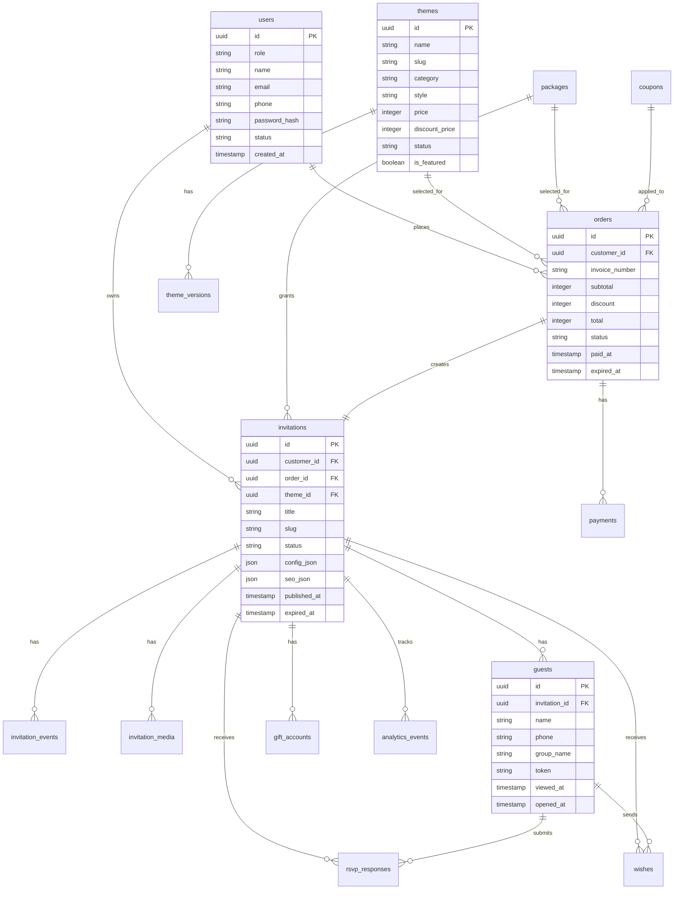

### 5.2 Important Tables

| Table | Purpose |
|---|---|
| `users` | Admin dan customer. |
| `themes` | Metadata tema yang tampil di katalog. |
| `theme_versions` | Versi renderer/schema tema. |
| `packages` | Paket Basic/Premium/Signature dan limit fitur. |
| `add_ons` | Add-on seperti domain, extra gallery, renewal. |
| `coupons` | Kupon promo/referral. |
| `orders` | Invoice dan status order. |
| `payments` | Payment gateway log dan callback payload. |
| `entitlements` | Hak akses fitur berdasarkan order/paket/add-on. |
| `invitations` | Undangan utama dan `config_json`. |
| `invitation_events` | Jadwal acara. |
| `invitation_media` | Foto/audio/video/OG image. |
| `guests` | Guest list dan personalized token. |
| `rsvp_responses` | Data RSVP. |
| `wishes` | Ucapan/doa. |
| `gift_accounts` | Rekening/e-wallet/alamat hadiah. |
| `analytics_events` | Event tracking. |
| `activity_logs` | Audit admin/customer actions. |

### 5.3 Invitation JSON Schema Strategy

Agar tema bisa diganti tanpa input ulang, data undangan harus mengikuti schema standar.

```json
{
  "basic": {
    "title": "The Wedding of Raditya & Nabila",
    "language": "id",
    "main_date": "2026-08-12"
  },
  "cover": {
    "headline": "The Wedding of",
    "guest_greeting": "Kepada Yth.",
    "cover_media_id": "uuid"
  },
  "couple": [
    {
      "role": "groom",
      "full_name": "Raditya Pratama",
      "nickname": "Radit",
      "father_name": "...",
      "mother_name": "...",
      "instagram": "raditya"
    }
  ],
  "story": [],
  "gallery": [],
  "rsvp": {
    "enabled": true,
    "max_attendees_per_response": 2,
    "cutoff_date": "2026-08-01"
  },
  "gift": {
    "enabled": true
  },
  "dresscode": {
    "enabled": true,
    "colors": []
  },
  "music": {
    "enabled": true,
    "media_id": "uuid"
  }
}
```

### 5.4 Indexing Recommendation

| Table | Index |
|---|---|
| `users` | unique email, unique phone nullable, role/status |
| `themes` | unique slug, status, category, is_featured |
| `orders` | customer_id, status, invoice_number unique, paid_at |
| `payments` | order_id, gateway_reference unique, status |
| `invitations` | customer_id, slug unique, status, expired_at |
| `guests` | invitation_id, token unique, phone nullable |
| `rsvp_responses` | invitation_id, guest_id, attendance_status |
| `wishes` | invitation_id, status, created_at |
| `analytics_events` | invitation_id, event_name, created_at |

---

## 6. Route dan API Design

### 6.1 Web Routes

```text
GET  /                         LandingController@index
GET  /themes                   ThemeCatalogController@index
GET  /themes/{theme:slug}      ThemeCatalogController@show
GET  /pricing                  PricingController@index
GET  /u/{invitation:slug}      PublicInvitationController@show
GET  /i/{guest:token}          PublicInvitationController@showByGuestToken
```

### 6.2 Customer App Routes

```text
GET  /app                                      Customer/DashboardController@index
GET  /app/invitations                         Customer/InvitationController@index
POST /app/invitations                         Customer/InvitationController@store
GET  /app/invitations/{invitation}/builder    Customer/BuilderController@edit
PUT  /app/invitations/{invitation}/builder    Customer/BuilderController@update
POST /app/invitations/{invitation}/publish    Customer/PublishController@store
POST /app/invitations/{invitation}/unpublish  Customer/PublishController@destroy
GET  /app/invitations/{invitation}/guests     Customer/GuestController@index
POST /app/invitations/{invitation}/guests     Customer/GuestController@store
POST /app/invitations/{invitation}/guests/import Customer/GuestImportController@store
GET  /app/invitations/{invitation}/rsvp       Customer/RsvpController@index
GET  /app/orders                              Customer/OrderController@index
POST /checkout                                CheckoutController@store
```

### 6.3 Public Submit Routes

```text
POST /public/invitations/{invitation:slug}/open
POST /public/invitations/{invitation:slug}/rsvp
POST /public/invitations/{invitation:slug}/wishes
POST /public/invitations/{invitation:slug}/track
```

### 6.4 Admin Routes

```text
GET    /admin                         Admin/DashboardController@index
GET    /admin/themes                  Admin/ThemeController@index
POST   /admin/themes                  Admin/ThemeController@store
PUT    /admin/themes/{theme}          Admin/ThemeController@update
GET    /admin/packages                Admin/PackageController@index
POST   /admin/packages                Admin/PackageController@store
GET    /admin/coupons                 Admin/CouponController@index
POST   /admin/coupons                 Admin/CouponController@store
GET    /admin/orders                  Admin/OrderController@index
GET    /admin/orders/{order}          Admin/OrderController@show
POST   /admin/orders/{order}/override Admin/PaymentOverrideController@store
GET    /admin/customers               Admin/CustomerController@index
GET    /admin/invitations             Admin/InvitationController@index
POST   /admin/invitations/{invitation}/force-unpublish
GET    /admin/reports                 Admin/ReportController@index
```

---

## 7. Payment Architecture

### 7.1 Payment Adapter Pattern

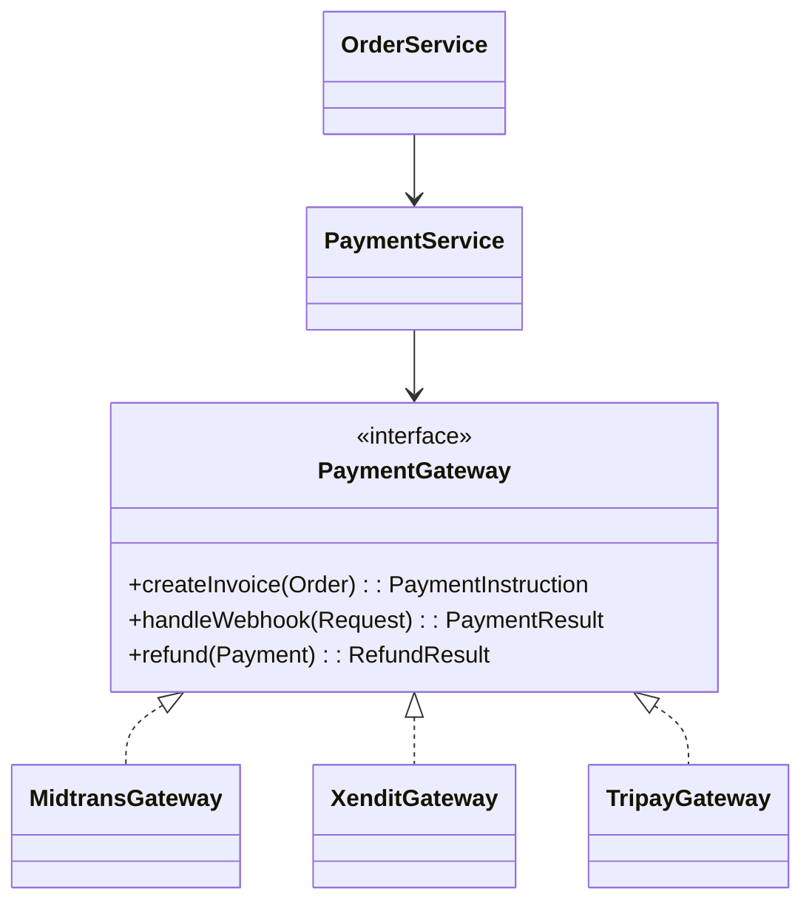

### 7.2 Payment Webhook Flow

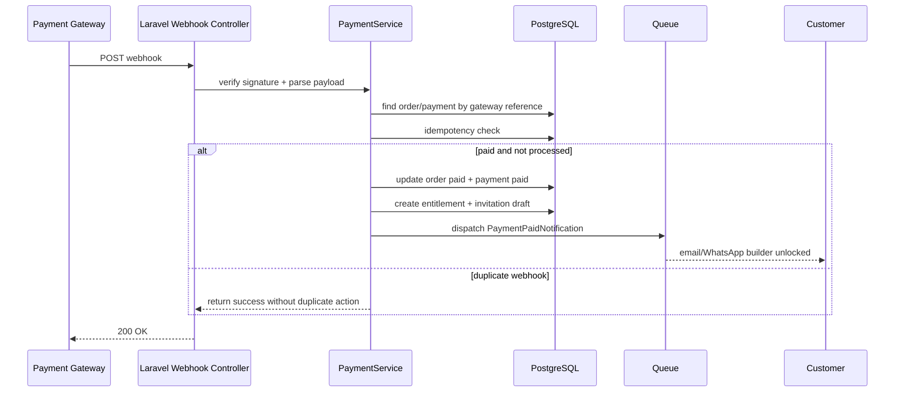

### 7.3 Payment Requirements

- Webhook signature wajib diverifikasi.
- Callback harus idempotent.
- Semua payload webhook disimpan di `payments.payload_json` atau `payment_webhook_logs`.
- Manual override hanya admin dan wajib alasan.
- Status order tidak boleh mundur dari `paid` ke `pending` karena webhook terlambat.
- Refund harus memiliki state dan audit log.

---

## 8. Media Pipeline

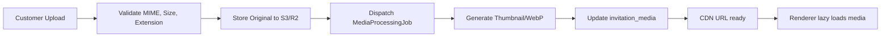

### Requirements

| Media | Format | Processing |
|---|---|---|
| Cover image | JPG/PNG/WebP | Resize, WebP, thumbnail. |
| Profile image | JPG/PNG/WebP | Square/crop optional, thumbnail. |
| Gallery | JPG/PNG/WebP | Resize, WebP, lazy load. |
| Audio | MP3/M4A optional | Size limit, metadata, no autoplay before user interaction if blocked. |
| OG image | JPG/PNG/WebP | Auto-generated fallback from cover/title. |
| CSV guest import | CSV | Validate columns, queue import for large file. |

---

## 9. Queue, Scheduler, Events

### 9.1 Event Flow

```mermaid
flowchart TB
    PaymentPaid[PaymentPaid Event] --> CreateEntitlement[Create Entitlement]
    PaymentPaid --> CreateDraft[Create Invitation Draft]
    PaymentPaid --> NotifyPaid[Notify Customer]

    InvitationPublished[InvitationPublished Event] --> GenerateOG[Generate OG Image]
    InvitationPublished --> NotifyPublish[Notify Customer]
    InvitationPublished --> TrackAnalytics[Track Analytics]

    RsvpSubmitted[RsvpSubmitted Event] --> UpdateCounter[Update Counters]
    RsvpSubmitted --> NotifyCustomer[Optional Notify Customer]

    Scheduler[Laravel Scheduler] --> PaymentExpiry[Expire unpaid orders]
    Scheduler --> EventReminders[Event date reminders]
    Scheduler --> RenewalReminders[Expiry renewal reminders]
    Scheduler --> RetentionJobs[Archive/delete expired data]
```

### 9.2 Queue Jobs

| Job | Queue | Purpose |
|---|---|---|
| `ProcessMediaJob` | media | Resize, thumbnail, WebP. |
| `SendNotificationJob` | notifications | Email/WhatsApp. |
| `ImportGuestsJob` | imports | CSV guest import. |
| `GenerateOgImageJob` | media | Create share image. |
| `ExpireOrdersJob` | scheduler | Expire unpaid orders. |
| `ExpireInvitationsJob` | scheduler | Mark expired invitations. |
| `SendLifecycleReminderJob` | notifications | Abandoned checkout, draft, event, renewal. |
| `ExportRsvpJob` | exports | Generate CSV/XLSX. |
| `AiCopywritingJob` | ai | Fase 2 AI generation. |
| `AiModerationJob` | ai | Fase 2 moderation. |

---

## 10. Agentic Architecture

Pendekatan agentic dibagi menjadi tiga layer agar aman dan tidak bercampur.

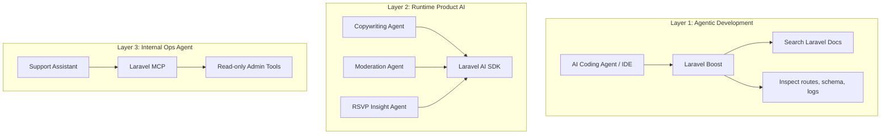

### 10.1 Layer 1 — Laravel Boost untuk Development

Fungsi:

- Membantu AI coding agent memahami aplikasi Laravel.
- Mengakses dokumentasi Laravel/package yang relevan.
- Inspect route, schema, logs, config, dan error selama development.
- Membantu debugging dan penulisan kode sesuai konvensi Laravel.

Guardrail:

- Dev-only, tidak menjadi fitur customer.
- Tidak dipakai untuk menjalankan aksi produksi tanpa review manusia.
- Perubahan kode tetap lewat git, PR, dan test.

### 10.2 Layer 2 — Laravel AI SDK untuk Runtime Product AI

Fitur potensial:

- AI copywriting teks undangan.
- AI rekomendasi tema berdasarkan preferensi style.
- AI moderation assist untuk ucapan.
- AI RSVP insight untuk customer.

Guardrail:

- AI output harus bisa diedit customer.
- AI moderation tidak menghapus otomatis tanpa policy jelas.
- Semua prompt dan output penting dapat diaudit.
- Rate limit dan cost control wajib.

### 10.3 Layer 3 — Laravel MCP untuk Internal Ops

Fase 2/opsional:

- Support assistant membaca order/payment status.
- Admin assistant merangkum RSVP/issue.
- MCP tools default read-only.
- Aksi write seperti refund/force unpublish wajib human confirmation dan audit log.

---

## 11. Security Architecture

### 11.1 Security Zones

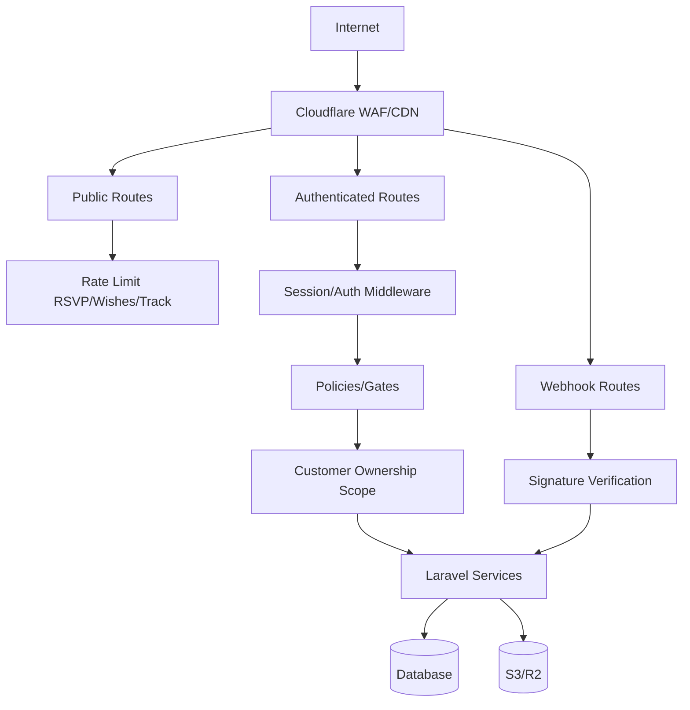

### 11.2 Security Requirements

| Area | Requirement |
|---|---|
| Auth | Password hashing, email verification optional, admin route protected. |
| Authorization | Policies for every invitation/order/customer object. |
| Tenant isolation | Customer only accesses own invitations/orders/guests. |
| CSRF | Enabled for web forms; webhook excluded but signature verified. |
| XSS | Sanitize customer-generated rich text/wishes. |
| Upload | Validate MIME, extension, size, scan optional. |
| Rate limit | Login, RSVP, wishes, tracking, upload. |
| Payment | Verify webhook signature and idempotency. |
| Audit | Admin override, force unpublish, refund, suspend, delete. |
| Secrets | `.env`, no secrets in repo, rotate provider keys. |
| Privacy | Default `noindex`, data retention jobs, delete/export support. |

---

## 12. Caching dan Performance

### 12.1 Cache Strategy

| Area | Strategy |
|---|---|
| Landing page | CDN + server cache. |
| Theme catalog | Cache list active themes, invalidate on admin update. |
| Public invitation | Cache rendered response for published invitation with short TTL/tag. |
| Invitation preview | No public CDN cache; customer-auth preview. |
| Media | CDN cache immutable URLs. |
| Analytics counters | Redis increment, periodic flush if needed. |
| RSVP form | No aggressive cache for submission endpoints. |

### 12.2 Public Invitation Performance

- Blade renderer server-side.
- Critical CSS minimal.
- Lazy load gallery images.
- Use WebP thumbnails.
- Audio starts only after user interaction if autoplay blocked.
- CDN for images and static assets.
- Avoid large JS framework on public page.
- Target mobile LCP < 2.5s for typical invitation with optimized media.

---

## 13. Observability dan Ops

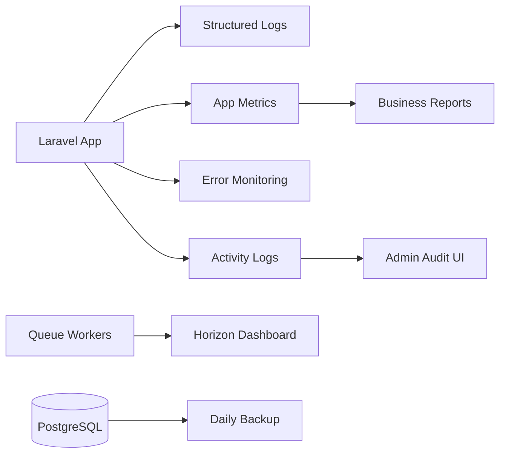

### Observability Checklist

| Area | What to Monitor |
|---|---|
| Web | 5xx rate, latency, slow routes. |
| Queue | Failed jobs, queue length, processing time. |
| Payment | Webhook failures, duplicate callbacks, status mismatch. |
| Media | Failed processing, storage error, large uploads. |
| Public invitation | Page load, error rate, view/open events. |
| RSVP/wishes | Spam spikes, rate limited requests. |
| AI | Token usage, cost, error, latency. |
| Business | Funnel, conversion, revenue, paid-to-published. |

---

## 14. Deployment Architecture

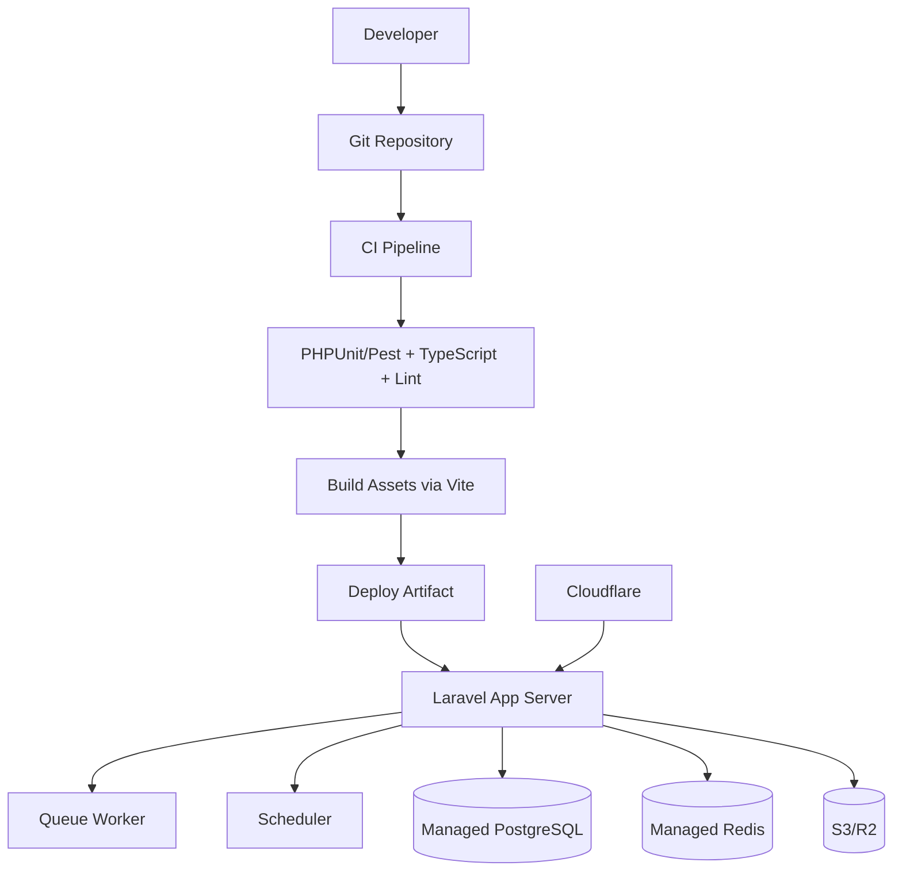

### Environment

| Environment | Purpose |
|---|---|
| Local | Development dengan Laravel Boost, test data. |
| Staging | QA payment sandbox, preview theme, user acceptance test. |
| Production | Live customer. |

### Deployment Requirements

- Zero/minimal downtime deployment.
- `php artisan migrate --force` hanya setelah backup/CI pass.
- Queue worker restart setelah deploy.
- Config/routes/views cache enabled production.
- Rollback plan tersedia.
- Database backup harian.
- Storage lifecycle policy untuk expired media jika retention terpenuhi.

---

## 15. Development Workflow dengan Agentic Approach

```mermaid
flowchart LR
    Req[Requirement dari PRD] --> Issue[Breakdown Issue]
    Issue --> Agent[AI Agent + Laravel Boost]
    Agent --> Code[Code Patch]
    Code --> Test[Automated Tests]
    Test --> Review[Human Code Review]
    Review --> Staging[Deploy Staging]
    Staging --> QA[QA Acceptance Criteria]
    QA --> Prod[Deploy Production]
    Prod --> Monitor[Monitor Metrics]
```

### 15.1 Agentic Development Rules

- Setiap issue harus mencantumkan PRD ID dan acceptance criteria.
- AI agent boleh membantu membuat kode, test, migration, dan refactor.
- Laravel Boost dipakai untuk mencari docs, inspect route/schema/log selama development.
- Semua hasil agent wajib lewat test dan review manusia.
- Tidak ada agent yang menjalankan aksi produksi berisiko tanpa approval.
- Prompt/decision penting untuk fitur AI runtime dicatat sebagai artifact dokumentasi.

### 15.2 Suggested Repository Structure

```text
app/
  Domain/
    Catalog/
    Orders/
    Payments/
    Invitations/
    Guests/
    Rsvp/
    Media/
    Notifications/
    Analytics/
    Ai/
  Http/
    Controllers/
      Public/
      Customer/
      Admin/
  Policies/
  Jobs/
  Events/
  Listeners/
resources/
  js/
    pages/
      customer/
      admin/
    components/
  views/
    public/
      invitations/
      themes/
    emails/
database/
  migrations/
  seeders/
routes/
  web.php
  auth.php
  admin.php
  webhooks.php
```

---

## 16. Testing Strategy

| Test Type | Scope |
|---|---|
| Unit tests | Services: pricing, coupon, entitlement, slug, package limit. |
| Feature tests | Auth, checkout, webhook, builder save, publish, RSVP. |
| Policy tests | Customer cannot access other customer data. |
| Browser tests | Critical flows: checkout, builder, public RSVP. |
| Snapshot/visual tests | Theme renderer output for key templates. |
| Queue tests | Media processing, notification, import, export. |
| Security tests | XSS sanitization, rate limit, upload validation. |
| AI tests | Fake AI responses, structured output validation. |

### Critical Test Cases

| ID | Test | Expected Result |
|---|---|---|
| T-ORD-01 | Paid webhook duplicate | Entitlement created only once. |
| T-POL-01 | Customer A opens Customer B invitation builder | 403. |
| T-BLD-01 | Publish with missing event date | Validation error. |
| T-MEDIA-01 | Upload unsupported file | Rejected. |
| T-RSVP-01 | Guest submits RSVP | Response saved and counter updated. |
| T-WISH-01 | Wish with script tag | Script sanitized/escaped. |
| T-ADMIN-01 | Manual override without reason | Rejected. |
| T-CACHE-01 | Theme update invalidates catalog cache | New theme data visible. |

---

## 17. Technical Roadmap

| Sprint | Technical Focus | Output |
|---|---|---|
| 1 | Laravel setup, auth, roles, base layout | App foundation. |
| 2 | Catalog/theme admin | Theme CRUD and public catalog. |
| 3 | Packages, orders, payment adapter | Checkout flow. |
| 4 | Invitation schema and builder core | Draft/edit/save. |
| 5 | Blade public renderer and preview iframe | Public invitation MVP. |
| 6 | Media pipeline, gallery, music | Upload and optimized render. |
| 7 | RSVP, wishes, guest list | Guest engagement. |
| 8 | Admin ops, reports, notifications | Operational readiness. |
| 9 | Security/performance hardening | Launch readiness. |
| 10 | AI/runtime/partner/custom domain | Fase 2 expansion. |

---

## 18. Traceability Product to Technical

| Product Epic | Laravel Module | Key Tables | Key Risks |
|---|---|---|---|
| PRD-LANDING | Public Web | content_settings, themes | SEO/cache invalidation. |
| PRD-CAT | Catalog | themes, theme_versions | Preview mismatch. |
| PRD-AUTH | Identity | users | Role separation. |
| PRD-ORD | Orders/Payments | orders, payments, coupons | Webhook/idempotency. |
| PRD-BLD | Invitations/Builder | invitations, invitation_events, invitation_media | JSON schema drift. |
| PRD-PUB | Renderer | invitations, themes | Performance and privacy. |
| PRD-GUEST | Guests | guests | Link privacy and import errors. |
| PRD-RSVP | RSVP/Wishes | rsvp_responses, wishes | Spam and duplicate responses. |
| PRD-ADM | Admin | all + activity_logs | Over-permission. |
| PRD-BILLING | Pricing/Entitlement | packages, add_ons, entitlements | Package limit inconsistency. |
| PRD-DOMAIN | Domain | domains/custom_domain table | DNS/SSL support burden. |
| PRD-AI | AI | ai_requests, ai_outputs optional | Cost, prompt safety, latency. |

---

## 19. Launch Readiness Checklist Teknis

| Area | Checklist |
|---|---|
| Auth | Admin/customer roles tested. |
| Payment | Sandbox and production webhook verified. |
| Builder | Autosave/draft/publish works. |
| Renderer | Public and preview use same Blade renderer. |
| Media | Upload, resize, CDN URLs tested. |
| Security | Policies, rate limit, XSS protection, upload validation. |
| Queue | Workers and failed job alert ready. |
| Backup | Database backup and restore tested. |
| Logs | Error and audit logs accessible. |
| Performance | Public invitation mobile performance tested. |
| Analytics | Funnel and invitation events captured. |
| Admin | Manual override, force unpublish, and reports available. |
| Docs | Business/Product/Technical docs linked in repo. |

---

## 20. Referensi Teknis

- Laravel 13 Starter Kits: `https://laravel.com/docs/13.x/starter-kits`
- Laravel Boost: `https://laravel.com/docs/13.x/boost`
- Laravel AI SDK: `https://laravel.com/docs/13.x/ai-sdk`
- Laravel MCP: `https://laravel.com/docs/13.x/mcp`
- Laravel Queues: `https://laravel.com/docs/13.x/queues`
- Laravel Authorization: `https://laravel.com/docs/13.x/authorization`
- Laravel File Storage: `https://laravel.com/docs/13.x/filesystem`
